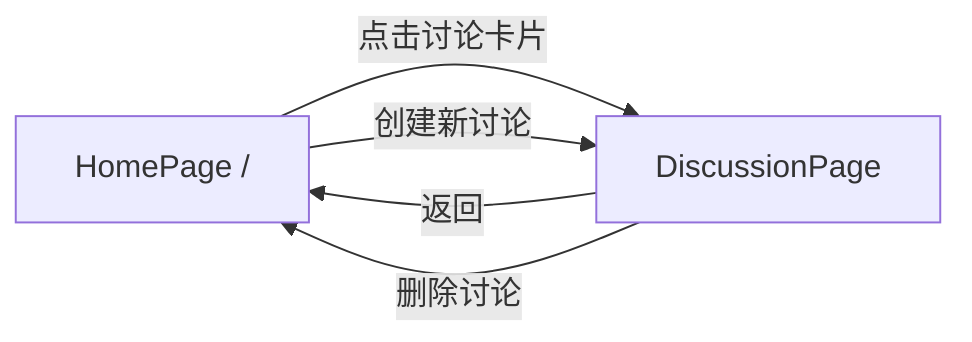

# 02 — Information Architecture

> DDD 阶段 · 信息架构 · AI Panel Studio

---

## 1. 页面路由

```
/                          讨论列表页（首页）
/discussions/:id           讨论详情页（根据 status 渲染不同视图）
```

路由策略：单一讨论路由 + 状态驱动视图切换。Discussion 的 `status` 决定渲染哪个子视图：

| status | 渲染视图 | 说明 |
|--------|----------|------|
| `PENDING_PANEL` | `PendingPanelView` | 显示话题、等待嘉宾生成 |
| `PANEL_READY` | `PanelReadyView` | 嘉宾阵容展示 + 确认/替换 |
| `IN_PROGRESS` | `StudioView` | 实时演播厅 |
| `ENDED` | `EndedView` | 讨论结果与总结 |

---

## 2. 页面层级

```
App
├── HomePage (/)
│   ├── PageHeader (Logo + 标题)
│   ├── CreateDiscussionCard (话题输入 + 专家人数选择)
│   ├── DiscussionList (进行中的讨论列表)
│   │   └── DiscussionCard[] (缩略信息 + 状态标签)
│   └── EmptyState (无讨论时的引导)
│
└── DiscussionPage (/discussions/:id)
    ├── TopBar (返回 + 话题 + 状态指示 + WS状态)
    ├── [status === PENDING_PANEL] PendingPanelView
    ├── [status === PANEL_READY] PanelReadyView
    ├── [status === IN_PROGRESS] StudioView
    └── [status === ENDED] EndedView
```

---

## 3. 导航关系



**导航规则：**
- 所有讨论详情页均可通过浏览器地址栏直接访问（`/discussions/:id`）
- 讨论结束后保持在详情页，不自动跳转
- 删除讨论后自动跳回首页
- 浏览器前进/后退行为正常（Vue Router history 模式）

---

## 4. 各页面区域信息优先级

### 4.1 首页

| 优先级 | 区域 | 内容 | 说明 |
|--------|------|------|------|
| **P0** | CreateDiscussionCard | 话题输入框 + 专家人数选择器 + 创建按钮 | 主要操作入口 |
| **P1** | DiscussionList | 进行中/已结束讨论列表 | 按更新时间倒序 |
| **P2** | EmptyState | "暂无讨论，请创建一个" | 列表为空时显示 |

### 4.2 讨论详情页 — PANEL_READY

| 优先级 | 区域 | 内容 |
|--------|------|------|
| **P0** | 话题标题 | 讨论主题 |
| **P1** | 嘉宾阵容 | 主持人 + 专家卡片阵列，每人显示姓名/职业/立场/颜色标识 |
| **P1** | 操作区 | "开始讨论"主按钮 + "全部重新生成"次按钮 |
| **P2** | 替换操作 | 每位专家卡片上的"替换"按钮 |

### 4.3 讨论详情页 — IN_PROGRESS（演播厅）

| 优先级 | 区域 | 内容 |
|--------|------|------|
| **P0** | 当前发言区 | 发言人姓名、头衔、发言内容（大字号突出） |
| **P0** | 嘉宾阵列 | 主持人 + 专家头像/色块，当前发言人视觉聚焦 |
| **P1** | 主题 + 状态栏 | 讨论话题 + IN_PROGRESS 状态 + WS 连接指示 |
| **P1** | 共识/分歧面板 | 实时更新的共识与分歧列表（独立滚动） |
| **P1** | 结束操作 | "结束讨论"按钮（醒目但非干扰） |
| **P2** | Transcript 面板 | 完整发言记录（独立滚动，自动追随最新） |

### 4.4 讨论详情页 — ENDED

| 优先级 | 区域 | 内容 |
|--------|------|------|
| **P0** | 主持人总结 | 自然语言总结文本 |
| **P1** | 共识/分歧总结 | 最终共识与分歧列表 |
| **P1** | Transcript | 完整讨论记录（可分页浏览） |
| **P2** | 操作区 | "返回首页"按钮 + "删除讨论"按钮 |

---

## 5. 全局元素

| 元素 | 位置 | 说明 |
|------|------|------|
| WebSocket 连接状态 | 演播厅 TopBar 常驻 | 已连接/重连中/已断开 三态 |
| Toast 通知 | 右上角浮层 | API 错误、操作反馈、断线提示 |
| 二次确认对话框 | 居中模态 | 删除讨论、结束讨论等破坏性操作 |
