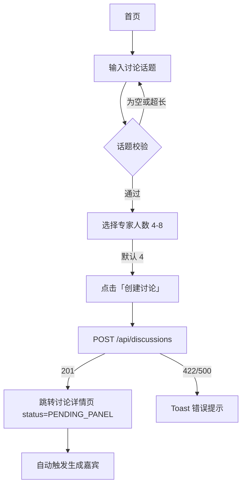
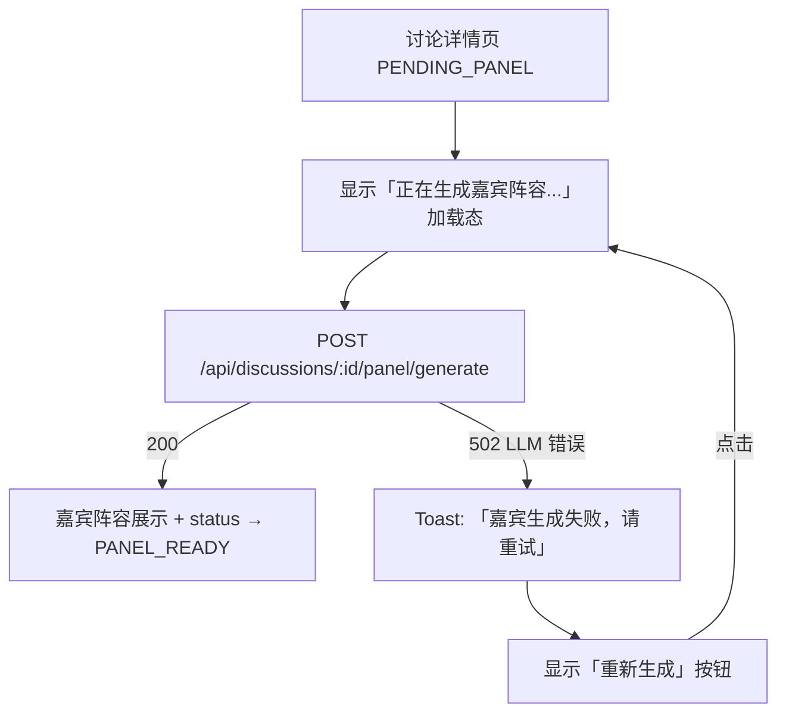
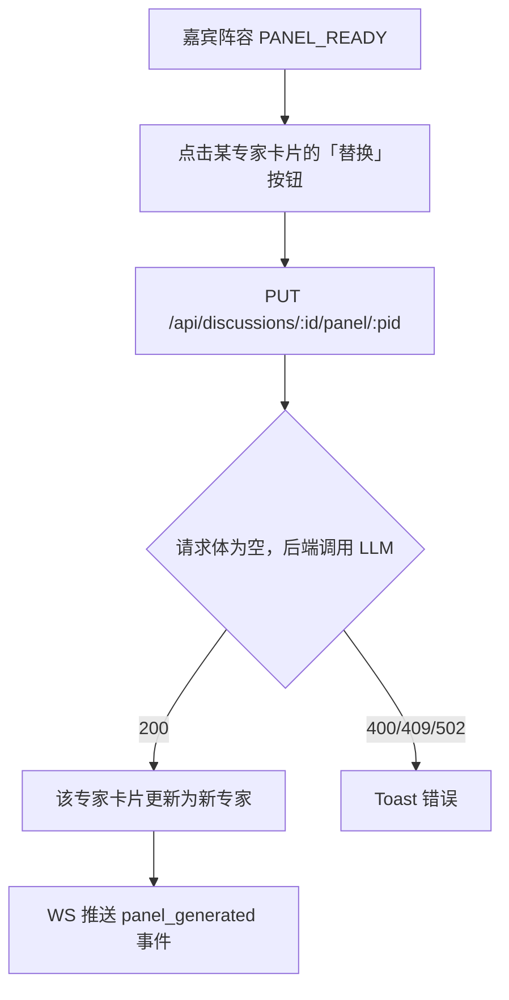
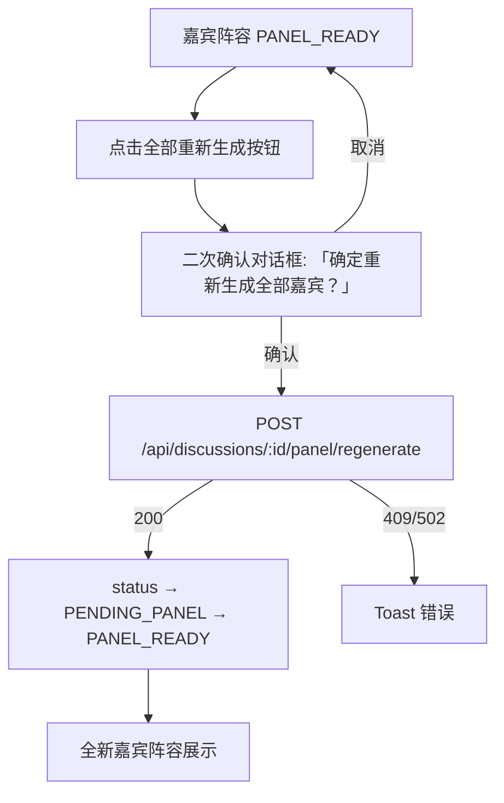
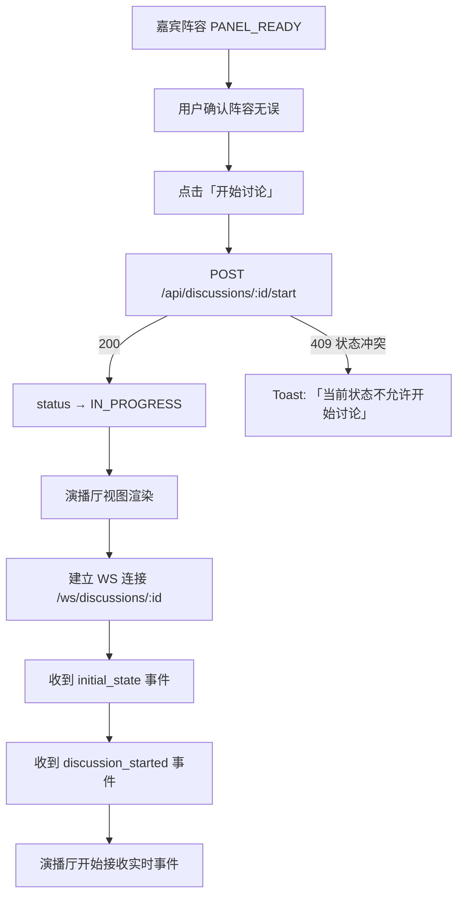
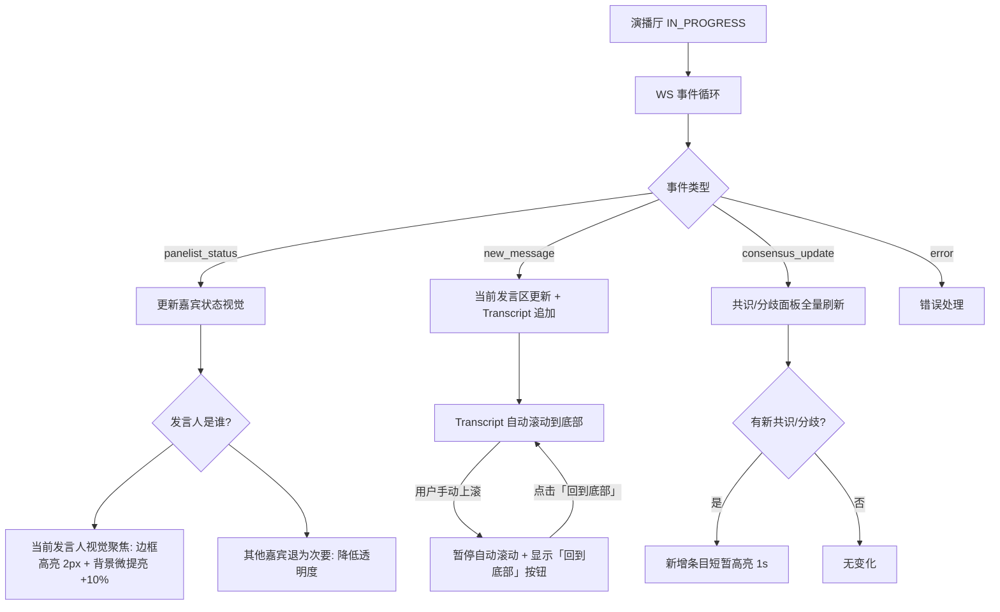
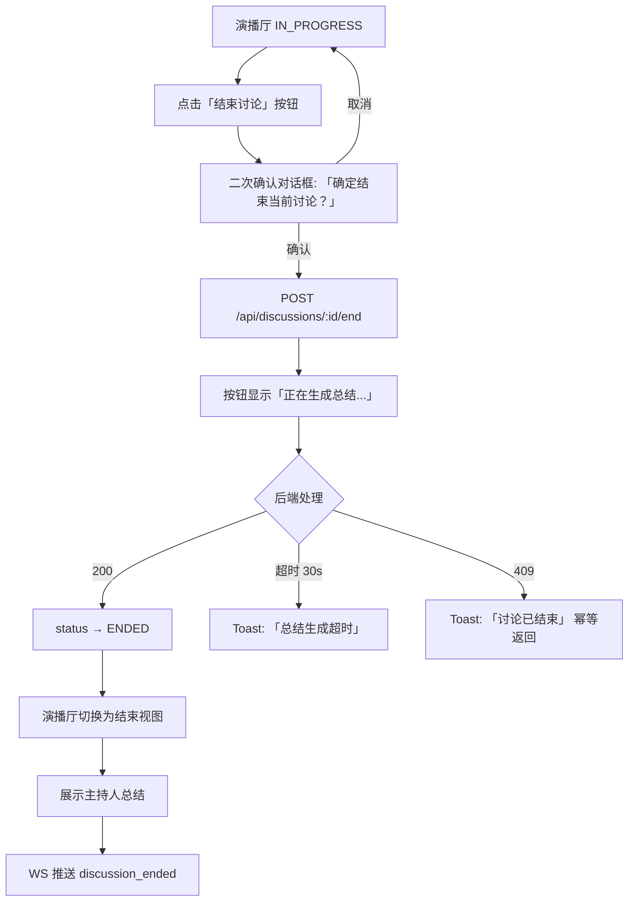
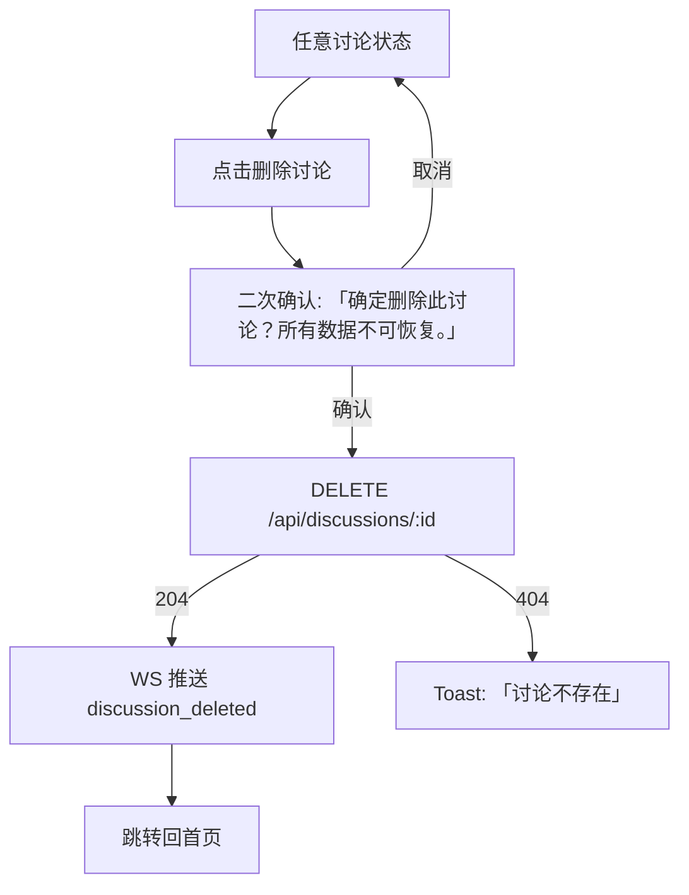
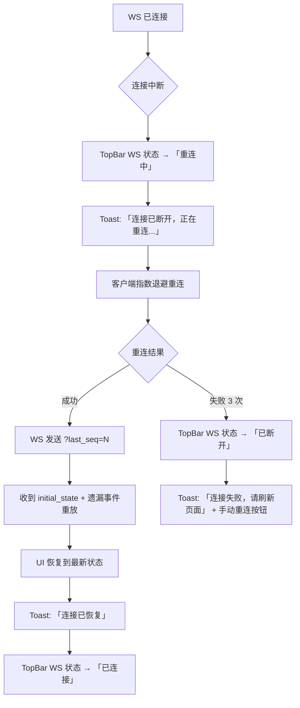
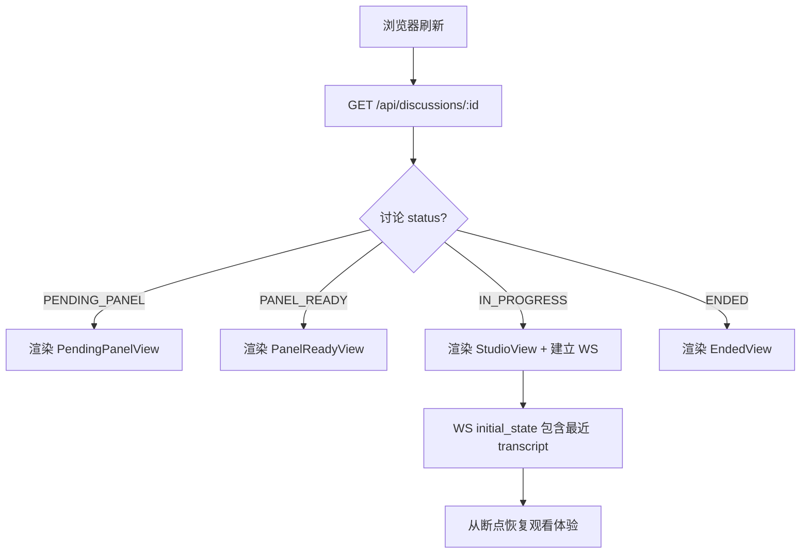

# 03 — User Flow

> DDD 阶段 · 用户流程 · AI Panel Studio

---

## 1. 创建讨论

---

## 2. 生成嘉宾阵容

---

## 3. 替换单个专家

**同时发生：**

- 专家卡片短暂显示替换中状态（skeleton/浅灰色块）
- 替换完成后卡片内容平滑过渡到新专家（fade transition 200ms）

---

## 4. 全部重新生成

---

## 5. 确认阵容并开始讨论

---

## 6. 实时观看讨论

---

## 7. 手动结束讨论

---

## 8. 删除讨论

---

## 9. WebSocket 断线重连

---

## 10. 错误恢复路径

| 场景                             | 用户可见                   | 恢复方式                 |
| -------------------------------- | -------------------------- | ------------------------ |
| LLM API 超时 (502)               | Toast + 重试按钮           | 点击重试                 |
| LLM 频率限制 (429)               | Toast "服务繁忙，稍后重试" | 自动退避重试             |
| LLM 服务不可用 (503)             | Toast "服务暂不可用"       | 手动重试                 |
| WS 不可恢复错误                  | 全屏错误状态 + 刷新按钮    | 浏览器刷新               |
| 讨论引擎崩溃（僵尸 IN_PROGRESS） | Toast "讨论引擎已停止"     | 自动标记 ENDED，提示用户 |
| API 校验错误 (422)               | 字段级错误提示             | 修正输入后重试           |
| 状态冲突 (409)                   | Toast 说明当前状态         | 刷新页面获取最新状态     |

---

## 11. 刷新恢复

