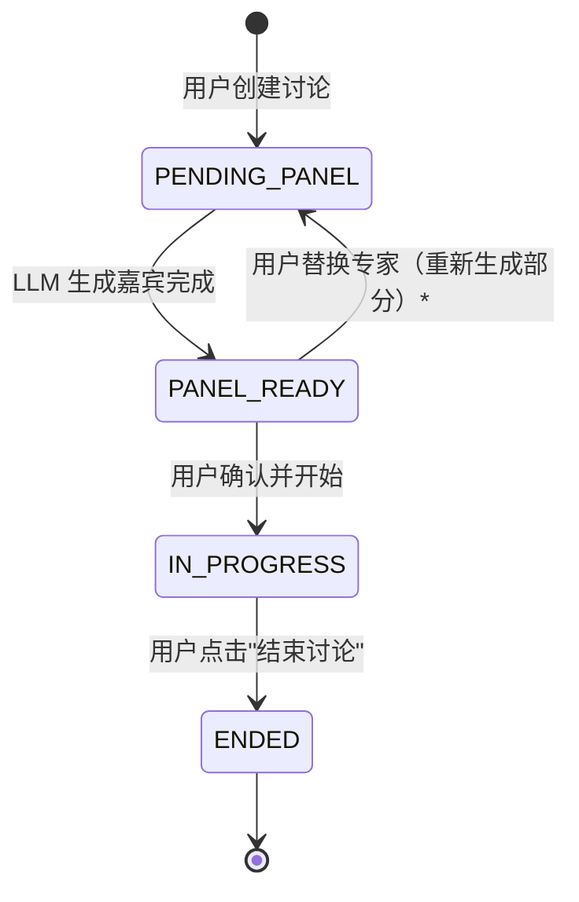
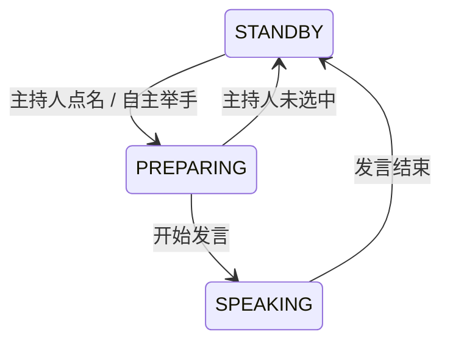
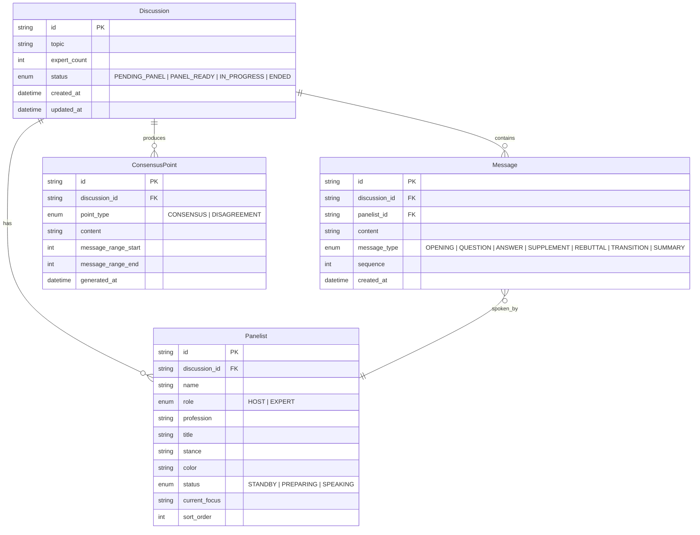

# 01 — 领域模型

> SDD 阶段 · 数据建模 · AI Panel Studio

---

## 1. 核心实体

### 1.1 Discussion（讨论）

| 字段 | 类型 | 必填 | 说明 |
|------|------|------|------|
| `id` | `str (UUID)` | ✅ | 主键 |
| `topic` | `str` | ✅ | 讨论话题，用户输入 |
| `expert_count` | `int` | ✅ | 专家人数，范围 4–8，默认 4 |
| `status` | `DiscussionStatus` | ✅ | 讨论生命周期状态 |
| `created_at` | `datetime` | ✅ | 创建时间 |
| `updated_at` | `datetime` | ✅ | 最后更新时间 |

**`DiscussionStatus` 枚举：**

| 值 | 含义 | 触发条件 |
|----|------|----------|
| `PENDING_PANEL` | 待生成嘉宾阵容 | 讨论刚创建 |
| `PANEL_READY` | 嘉宾已生成，等待用户确认 | LLM 生成嘉宾完成 |
| `IN_PROGRESS` | 讨论进行中 | 用户点击"开始讨论" |
| `ENDED` | 讨论已结束 | 用户点击"结束讨论" |

**状态流转图：**

> *注：替换单个专家不触发状态回退，仅当全部重新生成时才回到 `PENDING_PANEL`。

---

### 1.2 Panelist（嘉宾，含主持人）

| 字段 | 类型 | 必填 | 说明 |
|------|------|------|------|
| `id` | `str (UUID)` | ✅ | 主键 |
| `discussion_id` | `str (UUID)` | ✅ | FK → Discussion |
| `name` | `str` | ✅ | 姓名，LLM 生成 |
| `role` | `PanelistRole` | ✅ | HOST / EXPERT |
| `profession` | `str` | ✅ | 职业，LLM 生成 |
| `title` | `str` | ✅ | 头衔/Title，LLM 生成 |
| `stance` | `str` | ✅ | 立场，LLM 生成 |
| `color` | `str` | ✅ | 颜色标识，**前端分配**并写入 DB（如 `#FF6B6B`） |
| `status` | `PanelistStatus` | ✅ | 实时运行状态 |
| `current_focus` | `str \| None` | | 公开思考摘要（非隐藏 CoT） |
| `sort_order` | `int` | ✅ | 排序，主持人为 0，专家按生成顺序排列 |

**`PanelistRole` 枚举：**

| 值 | 含义 |
|----|------|
| `HOST` | 主持人（每场讨论仅 1 人） |
| `EXPERT` | 专家嘉宾 |

**`PanelistStatus` 枚举：**

| 值 | 含义 |
|----|------|
| `STANDBY` | 待机（当前未参与发言） |
| `PREPARING` | 准备发言（举手/被点名/正在组织语言） |
| `SPEAKING` | 发言中 |

**状态流转：**

---

### 1.3 Message（发言 / Transcript 条目）

| 字段 | 类型 | 必填 | 说明 |
|------|------|------|------|
| `id` | `str (UUID)` | ✅ | 主键 |
| `discussion_id` | `str (UUID)` | ✅ | FK → Discussion |
| `panelist_id` | `str (UUID)` | ✅ | FK → Panelist |
| `content` | `str` | ✅ | 发言内容，1–2 句 |
| `message_type` | `MessageType` | ✅ | 发言类型 |
| `sequence` | `int` | ✅ | 发言序号，全局递增 |
| `created_at` | `datetime` | ✅ | 发言时间 |

**`MessageType` 枚举：**

| 值 | 含义 | 典型发言人 |
|----|------|------------|
| `OPENING` | 开场白 | 主持人 |
| `QUESTION` | 提问/追问 | 主持人 |
| `ANSWER` | 回答 | 专家 |
| `SUPPLEMENT` | 补充观点 | 专家 |
| `REBUTTAL` | 反驳 | 专家 |
| `TRANSITION` | 串联/过渡 | 主持人 |
| `SUMMARY` | 总结 | 主持人 |

---

### 1.4 ConsensusPoint（共识 / 分歧）

| 字段 | 类型 | 必填 | 说明 |
|------|------|------|------|
| `id` | `str (UUID)` | ✅ | 主键 |
| `discussion_id` | `str (UUID)` | ✅ | FK → Discussion |
| `point_type` | `ConsensusType` | ✅ | 共识 / 分歧 |
| `content` | `str` | ✅ | 内容描述 |
| `message_range_start` | `int \| None` | | 关联发言起始序号 |
| `message_range_end` | `int \| None` | | 关联发言结束序号 |
| `generated_at` | `datetime` | ✅ | 生成时间 |

**`ConsensusType` 枚举：**

| 值 | 含义 |
|----|------|
| `CONSENSUS` | 共识 |
| `DISAGREEMENT` | 分歧 |

---

## 2. 实体关系图（ER）

---

## 3. 业务不变量

| # | 不变量 |
|---|--------|
| I1 | 每场 Discussion 有且仅有一个 `role=HOST` 的 Panelist |
| I2 | 每场 Discussion 的 EXPERT 数量 = `expert_count`，范围 [4, 8] |
| I3 | Message.sequence 在单个 Discussion 内严格连续递增 |
| I4 | 只有 `IN_PROGRESS` 状态的 Discussion 才产生新的 Message 和 ConsensusPoint |
| I5 | 替换单个专家时 Discussion 状态保持 `PANEL_READY`，不回到 `PENDING_PANEL` |
| I6 | ConsensusPoint 的 message_range 必须引用实际存在的 Message 序号 |
| I7 | 一次共识提炼（3–5 条发言）可产生 0–N 条 ConsensusPoint |

---

## 4. 边界说明

| 边界 | 决策 |
|------|------|
| 用户身份 | 无用户系统，本地运行，所有讨论全局可见 |
| 讨论持久化 | 全部写入 SQLite，永久保留，前端提供删除按钮 |
| 录制/回放 | MVP 不实现，数据模型预留扩展点（Message 已含完整 transcript） |
| 并发讨论 | 多讨论通过 discussion_id 隔离，无硬性数量上限 |
