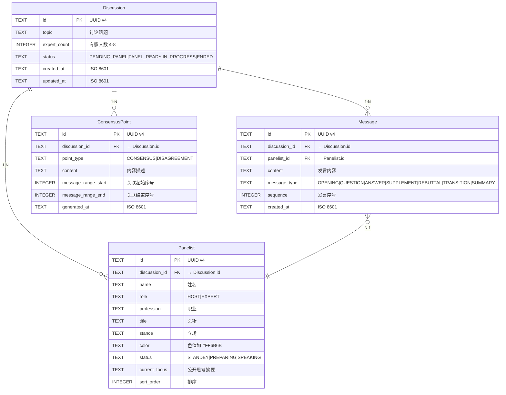

# 03 — 数据库 Schema

> SDD 阶段 · SQLite + SQLAlchemy · AI Panel Studio

---

## 1. ER 图



---

## 2. 表结构 DDL

### 2.1 discussion

```sql
CREATE TABLE IF NOT EXISTS discussion (
    id            TEXT PRIMARY KEY,
    topic         TEXT NOT NULL,
    expert_count  INTEGER NOT NULL DEFAULT 4 CHECK(expert_count >= 4 AND expert_count <= 8),
    status        TEXT NOT NULL DEFAULT 'PENDING_PANEL'
                  CHECK(status IN ('PENDING_PANEL','PANEL_READY','IN_PROGRESS','ENDED')),
    created_at    TEXT NOT NULL DEFAULT (datetime('now')),
    updated_at    TEXT NOT NULL DEFAULT (datetime('now'))
);

CREATE INDEX idx_discussion_status ON discussion(status);
CREATE INDEX idx_discussion_created ON discussion(created_at DESC);
```

### 2.2 panelist

```sql
CREATE TABLE IF NOT EXISTS panelist (
    id            TEXT PRIMARY KEY,
    discussion_id TEXT NOT NULL REFERENCES discussion(id) ON DELETE CASCADE,
    name          TEXT NOT NULL,
    role          TEXT NOT NULL CHECK(role IN ('HOST','EXPERT')),
    profession    TEXT NOT NULL,
    title         TEXT NOT NULL,
    stance        TEXT NOT NULL,
    color         TEXT NOT NULL,
    status        TEXT NOT NULL DEFAULT 'STANDBY'
                  CHECK(status IN ('STANDBY','PREPARING','SPEAKING')),
    current_focus TEXT,
    sort_order    INTEGER NOT NULL DEFAULT 0,

    UNIQUE(discussion_id, role, sort_order)  -- 确保每个讨论仅一个主持人(sort_order=0)
);

CREATE INDEX idx_panelist_discussion ON panelist(discussion_id);
```

### 2.3 message

```sql
CREATE TABLE IF NOT EXISTS message (
    id            TEXT PRIMARY KEY,
    discussion_id TEXT NOT NULL REFERENCES discussion(id) ON DELETE CASCADE,
    panelist_id   TEXT NOT NULL REFERENCES panelist(id) ON DELETE CASCADE,
    content       TEXT NOT NULL,
    message_type  TEXT NOT NULL
                  CHECK(message_type IN ('OPENING','QUESTION','ANSWER','SUPPLEMENT','REBUTTAL','TRANSITION','SUMMARY')),
    sequence      INTEGER NOT NULL,
    created_at    TEXT NOT NULL DEFAULT (datetime('now')),

    UNIQUE(discussion_id, sequence)
);

CREATE INDEX idx_message_discussion ON message(discussion_id);
CREATE INDEX idx_message_sequence ON message(discussion_id, sequence);
```

### 2.4 consensus_point

```sql
CREATE TABLE IF NOT EXISTS consensus_point (
    id                  TEXT PRIMARY KEY,
    discussion_id       TEXT NOT NULL REFERENCES discussion(id) ON DELETE CASCADE,
    point_type          TEXT NOT NULL CHECK(point_type IN ('CONSENSUS','DISAGREEMENT')),
    content             TEXT NOT NULL,
    message_range_start INTEGER,
    message_range_end   INTEGER,
    generated_at        TEXT NOT NULL DEFAULT (datetime('now'))
);

CREATE INDEX idx_consensus_discussion ON consensus_point(discussion_id);
```

---

## 3. SQLAlchemy 模型（Python 参考）

```python
import uuid
from datetime import datetime, timezone
from enum import Enum

from sqlalchemy import (
    CheckConstraint,
    Column,
    DateTime,
    ForeignKey,
    Integer,
    String,
    Text,
    UniqueConstraint,
    create_engine,
)
from sqlalchemy.orm import DeclarativeBase, Mapped, relationship


class Base(DeclarativeBase):
    pass


def gen_uuid() -> str:
    return str(uuid.uuid4())


def utcnow() -> datetime:
    return datetime.now(timezone.utc)


# ── Enums ──────────────────────────────────────────────

class DiscussionStatus(str, Enum):
    PENDING_PANEL = "PENDING_PANEL"
    PANEL_READY   = "PANEL_READY"
    IN_PROGRESS   = "IN_PROGRESS"
    ENDED         = "ENDED"


class PanelistRole(str, Enum):
    HOST   = "HOST"
    EXPERT = "EXPERT"


class PanelistStatus(str, Enum):
    STANDBY    = "STANDBY"
    PREPARING  = "PREPARING"
    SPEAKING   = "SPEAKING"


class MessageType(str, Enum):
    OPENING     = "OPENING"
    QUESTION    = "QUESTION"
    ANSWER      = "ANSWER"
    SUPPLEMENT  = "SUPPLEMENT"
    REBUTTAL    = "REBUTTAL"
    TRANSITION  = "TRANSITION"
    SUMMARY     = "SUMMARY"


class ConsensusType(str, Enum):
    CONSENSUS     = "CONSENSUS"
    DISAGREEMENT  = "DISAGREEMENT"


# ── ORM Models ─────────────────────────────────────────

class Discussion(Base):
    __tablename__ = "discussion"

    id           = Column(String, primary_key=True, default=gen_uuid)
    topic        = Column(String, nullable=False)
    expert_count = Column(Integer, nullable=False, default=4)
    status       = Column(String, nullable=False, default=DiscussionStatus.PENDING_PANEL)
    created_at   = Column(DateTime, nullable=False, default=utcnow)
    updated_at   = Column(DateTime, nullable=False, default=utcnow, onupdate=utcnow)

    __table_args__ = (
        CheckConstraint("expert_count >= 4 AND expert_count <= 8"),
        CheckConstraint(f"status IN {tuple(s.value for s in DiscussionStatus)}"),
    )

    panelists        = relationship("Panelist", back_populates="discussion", cascade="all, delete-orphan")
    messages         = relationship("Message", back_populates="discussion", cascade="all, delete-orphan")
    consensus_points = relationship("ConsensusPoint", back_populates="discussion", cascade="all, delete-orphan")


class Panelist(Base):
    __tablename__ = "panelist"

    id            = Column(String, primary_key=True, default=gen_uuid)
    discussion_id = Column(String, ForeignKey("discussion.id", ondelete="CASCADE"), nullable=False)
    name          = Column(String, nullable=False)
    role          = Column(String, nullable=False)
    profession    = Column(String, nullable=False)
    title         = Column(String, nullable=False)
    stance        = Column(String, nullable=False)
    color         = Column(String, nullable=False)
    status        = Column(String, nullable=False, default=PanelistStatus.STANDBY)
    current_focus = Column(String, nullable=True)
    sort_order    = Column(Integer, nullable=False, default=0)

    __table_args__ = (
        CheckConstraint(f"role IN {tuple(r.value for r in PanelistRole)}"),
        CheckConstraint(f"status IN {tuple(s.value for s in PanelistStatus)}"),
    )

    discussion = relationship("Discussion", back_populates="panelists")
    messages   = relationship("Message", back_populates="panelist")


class Message(Base):
    __tablename__ = "message"

    id            = Column(String, primary_key=True, default=gen_uuid)
    discussion_id = Column(String, ForeignKey("discussion.id", ondelete="CASCADE"), nullable=False)
    panelist_id   = Column(String, ForeignKey("panelist.id", ondelete="CASCADE"), nullable=False)
    content       = Column(Text, nullable=False)
    message_type  = Column(String, nullable=False)
    sequence      = Column(Integer, nullable=False)
    created_at    = Column(DateTime, nullable=False, default=utcnow)

    __table_args__ = (
        CheckConstraint(f"message_type IN {tuple(t.value for t in MessageType)}"),
        UniqueConstraint("discussion_id", "sequence"),
    )

    discussion = relationship("Discussion", back_populates="messages")
    panelist   = relationship("Panelist", back_populates="messages")


class ConsensusPoint(Base):
    __tablename__ = "consensus_point"

    id                  = Column(String, primary_key=True, default=gen_uuid)
    discussion_id       = Column(String, ForeignKey("discussion.id", ondelete="CASCADE"), nullable=False)
    point_type          = Column(String, nullable=False)
    content             = Column(Text, nullable=False)
    message_range_start = Column(Integer, nullable=True)
    message_range_end   = Column(Integer, nullable=True)
    generated_at        = Column(DateTime, nullable=False, default=utcnow)

    __table_args__ = (
        CheckConstraint(f"point_type IN {tuple(t.value for t in ConsensusType)}"),
    )

    discussion = relationship("Discussion", back_populates="consensus_points")
```

---

## 4. 初始化与迁移

```bash
# 通过 SQLAlchemy 自动建表（开发阶段）
python -c "from app.models import Base, engine; Base.metadata.create_all(engine)"

# 初始化脚本（生产就绪版本）见: scripts/init_db.py
```

---

## 5. 样例数据

见 `scripts/seed_data.py`，至少包含 5 条预设讨论话题 + 嘉宾阵容。样例数据格式：

| discussion | topic                         | expert_count | panelists                                                                                     |
| ---------- | ----------------------------- | ------------ | --------------------------------------------------------------------------------------------- |
| 1          | AI 会取代人类创造力吗？       | 5            | 主持人 + 5 位专家（AI科学家、艺术家、哲学家、企业家、教育学家）                               |
| 2          | 2050 年的城市交通会是什么样？ | 4            | 主持人 + 4 位专家（城市规划师、自动驾驶工程师、环保主义者、经济学家）                         |
| 3          | 远程办公是未来还是过渡方案？  | 6            | 主持人 + 6 位专家（HR专家、心理学家、企业管理顾问、员工代表、办公空间设计师、IT基础设施专家） |
| 4          | 我们应该殖民火星吗？          | 4            | 主持人 + 4 位专家（航天工程师、伦理学家、经济学家、生物学家）                                 |
| 5          | 全民基本收入（UBI）可行吗？   | 5            | 主持人 + 5 位专家（经济学家、社会学家、政策制定者、企业家、劳工代表）                         |

---

## 6. 索引策略

| 表                  | 索引                          | 用途                           |
| ------------------- | ----------------------------- | ------------------------------ |
| `discussion`      | `status`                    | 按状态筛选（首页仅展示进行中） |
| `discussion`      | `created_at DESC`           | 按时间排序                     |
| `panelist`        | `discussion_id`             | 按讨论查嘉宾                   |
| `message`         | `discussion_id`             | 按讨论查发言                   |
| `message`         | `(discussion_id, sequence)` | 分页查询 transcript            |
| `consensus_point` | `discussion_id`             | 按讨论查共识                   |
