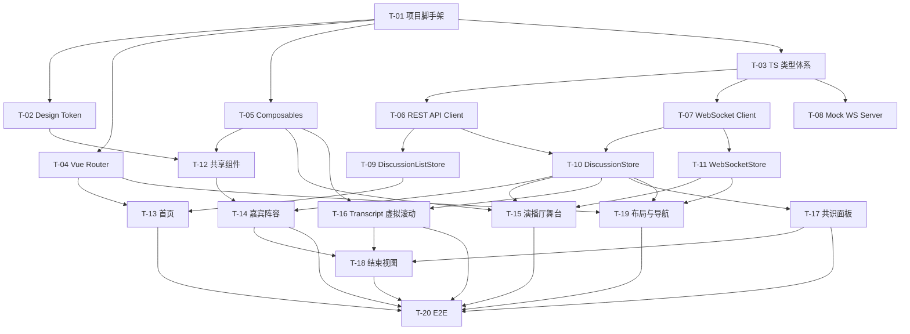

# 02 — Implementation Task Breakdown

> TDD 阶段 · 实现任务拆解 · AI Panel Studio 前端
>
> 共 4 个 Phase，20 个 Task。按依赖关系排序，每 Task 可独立验收。

---

## Phase 0: 工程基础设施（无上游依赖）

### T-01 · 项目脚手架

| 维度 | 详情 |
|------|------|
| **目标** | 创建 Vite + Vue 3 + TypeScript 项目骨架，集成 Pinia、Vue Router、ESLint、Prettier |
| **涉及文件** | `package.json`, `vite.config.ts`, `tsconfig.json`, `index.html`, `src/main.ts`, `src/App.vue`, `.env.development`, `.env.mock` |
| **前置依赖** | — |
| **实现要求** | `npm create vue@latest` 或手动搭；启用 strict TS；配置路径别名 `@/`；配置 `.env` 多模式 |
| **验收标准** | `npm run dev` 成功启动，显示空白 Vue 页面；`npm run build` 无错误 |
| **DDD 文档** | `01-frontend-technical-plan.md` §1–2 |

### T-02 · Design Token 落地

| 维度 | 详情 |
|------|------|
| **目标** | 将 `05-design-system.md` 中的全部 Token 以 CSS Variables + TS 常量形式落地 |
| **涉及文件** | `src/styles/variables.css`, `src/styles/reset.css`, `src/constants/design-tokens.ts`, `src/constants/panelist-colors.ts` |
| **前置依赖** | T-01 |
| **实现要求** | CSS 变量覆盖所有颜色/间距/字号/圆角/阴影；TS 常量仅包含颜色（运行时需要动态绑定的部分）；reset.css 设定暗色基线 |
| **验收标准** | 浏览器 DevTools 检查 `:root` 所有变量存在且值正确；`panelist-colors.ts` 导出 10 色数组 + `HOST_COLOR` |
| **DDD 文档** | `05-design-system.md` §1–5, §12 |

### T-03 · TypeScript 类型体系

| 维度 | 详情 |
|------|------|
| **目标** | 定义所有领域类型、枚举、API DTO、WS 事件联合类型 |
| **涉及文件** | `src/types/domain.ts`, `src/types/enums.ts`, `src/types/api.ts`, `src/types/websocket.ts` |
| **前置依赖** | — |
| **实现要求** | 枚举值严格对应 SDD §01-domain-model；WS 事件使用判别联合（discriminated union）；API DTO 覆盖所有 13 个端点的请求/响应类型 |
| **验收标准** | `tsc --noEmit` 通过；枚举值与 SDD 文档完全一致；WS 联合类型编译时穷尽检查 |
| **DDD 文档** | `01-domain-model.md` §1.1–1.4; `02-api-contract.md` §2–3 |

### T-04 · Vue Router 配置

| 维度 | 详情 |
|------|------|
| **目标** | 配置 `/` 和 `/discussions/:id` 两个路由 |
| **涉及文件** | `src/router/index.ts`, `src/views/HomePage.vue`（占位）, `src/views/DiscussionPage.vue`（占位） |
| **前置依赖** | T-01 |
| **实现要求** | history 模式；DiscussionPage 通过 `beforeEnter` 守卫 fetch `GET /discussions/:id` 初始化；404 无匹配讨论时渲染 NotFound |
| **验收标准** | 导航 `/` → 渲染 HomePage；`/discussions/uuid` → 渲染 DiscussionPage 占位；不存在 UUID → 404 |
| **DDD 文档** | `02-information-architecture.md` §1 |

### T-05 · 响应式断点 Composable + 工具 Composables

| 维度 | 详情 |
|------|------|
| **目标** | 实现 `useMediaQuery`、`useAutoScroll`、`useReducedMotion` 三个 composable |
| **涉及文件** | `src/composables/useMediaQuery.ts`, `src/composables/useAutoScroll.ts`, `src/composables/useReducedMotion.ts` |
| **前置依赖** | T-01 |
| **实现要求** | `useMediaQuery` 返回 `isMobile/isTablet/isDesktop` 三个 ref；`useAutoScroll` 暴露 `pause/resume/scrollToBottom` 方法；`useReducedMotion` 监听媒体查询 |
| **验收标准** | Vitest 单测：窗口 resize → 断点 ref 变化；手动上滚 → auto-scroll 暂停；`prefers-reduced-motion: reduce` → 返回 true |
| **DDD 文档** | `09-responsive-design.md` §1; `08-interaction-specification.md` §2; `10-accessibility.md` §6 |

---

## Phase 1: 数据层（依赖 Phase 0）

### T-06 · REST API Client

| 维度 | 详情 |
|------|------|
| **目标** | 实现 `fetch` 封装层 + 所有 13 个 REST 端点的调用函数 |
| **涉及文件** | `src/api/client.ts`, `src/api/discussions.ts`, `src/api/panel.ts`, `src/api/control.ts`, `mocks/handlers.ts`（同步） |
| **前置依赖** | T-03 |
| **实现要求** | `client.ts`: base URL 从 `import.meta.env` 读取、15s 超时、按 status 分类抛 `ApiError`（含 status + detail）；`discussions.ts`: list/get/create/delete；`panel.ts`: generate/get/replace/regenerate；`control.ts`: start/end |
| **验收标准** | Vitest + MSW：每个端点至少测 200 和一种错误码（404/409/422/502） |
| **DDD 文档** | `02-api-contract.md` §2, §4–5 |

### T-07 · WebSocket Client

| 维度 | 详情 |
|------|------|
| **目标** | 实现 WS 连接管理 + 事件分发 + sequence_id 去重/遗漏检测 + 1s/2s/4s 重连 + 15s 心跳 |
| **涉及文件** | `src/websocket/connection.ts`, `src/websocket/event-handler.ts`, `src/websocket/types.ts` |
| **前置依赖** | T-03 |
| **实现要求** | 详见 `01-frontend-technical-plan.md` §5；异常场景覆盖：网络断开、服务端重启、event 乱序、重复 event、连续遗漏 > 200 条 |
| **验收标准** | Vitest + fake timers：重连序列 1s→2s→4s→停止；重复 event 正确跳过；遗漏检测计数正确 |
| **DDD 文档** | `02-api-contract.md` §3; `08-interaction-specification.md` §3 |

### T-08 · Mock WebSocket Server（测试用）

| 维度 | 详情 |
|------|------|
| **目标** | 实现 `MockWsServer` 类，可模拟完整讨论生命周期的事件发射 |
| **涉及文件** | `mocks/ws-server.ts` |
| **前置依赖** | T-03 |
| **实现要求** | `emit(event, data)` 方法；`simulateDiscussion(messages, intervals)` 按指定间隔依次发射 panelist_status → new_message 事件；自动递增 `sequence_id` |
| **验收标准** | 组件测试中引用 `MockWsServer`，订阅方收到正确的事件序列和 sequence_id |
| **DDD 文档** | `02-api-contract.md` §3.2–3.5 |

### T-09 · Pinia Store — useDiscussionListStore

| 维度 | 详情 |
|------|------|
| **目标** | 首页讨论列表状态管理 |
| **涉及文件** | `src/stores/discussion-list.ts` |
| **前置依赖** | T-06 |
| **实现要求** | State: `discussions[]`, `loading`, `error`；Actions: `fetchList()`, `createDiscussion(topic, count)`, `deleteDiscussion(id)`；创建成功自动路由跳转 |
| **验收标准** | Vitest + MSW：列表加载成功/空列表/API 失败三种场景 |
| **DDD 文档** | `07-component-architecture.md` §3.1 |

### T-10 · Pinia Store — useDiscussionStore

| 维度 | 详情 |
|------|------|
| **目标** | 当前讨论的完整状态管理（核心 Store） |
| **涉及文件** | `src/stores/discussion.ts` |
| **前置依赖** | T-06, T-07, T-03 |
| **实现要求** | State: `discussion`, `panelists[]`, `messages[]`, `consensusPoints[]`, `loading`, `error`；Actions: `fetchDiscussion(id)`, `generatePanel()`, `replaceExpert(id)`, `regenerateAll()`, `start()`, `end()`；WS 事件处理：`handlePanelistStatus()`, `handleNewMessage()`, `handleConsensusUpdate()`, `handleDiscussionEnded()` |
| **验收标准** | Vitest + MSW + MockWsServer：完整流程 create→generate→start→simulate 3 messages→consensus→end，Store 状态每步验证 |
| **DDD 文档** | `04-page-state-matrix.md`; `07-component-architecture.md` §3.2 |

### T-11 · Pinia Store — useWebSocketStore

| 维度 | 详情 |
|------|------|
| **目标** | WebSocket 连接状态单例管理 |
| **涉及文件** | `src/stores/websocket.ts` |
| **前置依赖** | T-07 |
| **实现要求** | State: `status`（disconnected/connecting/connected/reconnecting），`lastSequenceId`，`missedEventCount`；Actions: `connect(discussionId)`, `disconnect()`；不在此 Store 中管理业务数据，业务事件通过 `useDiscussionStore` 处理 |
| **验收标准** | Vitest：模拟连接成功/断开/重连/3 次失败四种状态流转 |
| **DDD 文档** | `07-component-architecture.md` §3.3; `04-page-state-matrix.md` §4.2 |

---

## Phase 2: UI 组件层（依赖 Phase 0–1）

### T-12 · 共享组件

| 维度 | 详情 |
|------|------|
| **目标** | 实现 `GlobalToast`, `ConfirmDialog`, `ErrorOverlay`, `LoadingSkeleton`, `ScrollToBottomButton` |
| **涉及文件** | `src/components/shared/*.vue` |
| **前置依赖** | T-02, T-05 |
| **实现要求** | Toast: 堆叠 ≤3 条, 3s 自动消失, success/warning/error/info 四种 variant, 右上角滑入动画；ConfirmDialog: `role="dialog" aria-modal`, 焦点锁定, Escape 关闭, danger/default 两种 variant；ErrorOverlay: 全屏遮罩, 不可恢复错误专用；LoadingSkeleton: 可配置行数和宽度 |
| **验收标准** | 组件测试：Toast 堆叠/消失/Dialog 焦点循环/Skeleton 渲染行数 |
| **DDD 文档** | `05-design-system.md` §7–9; `08-interaction-specification.md` §4, §7; `10-accessibility.md` §4, §8 |

### T-13 · 首页组件

| 维度 | 详情 |
|------|------|
| **目标** | 实现 `HomePage`, `DiscussionCreateCard`, `TopicInput`, `ExpertCountSelector`, `DiscussionList`, `DiscussionCard`, `EmptyState` |
| **涉及文件** | `src/views/HomePage.vue`, `src/components/home/*.vue` |
| **前置依赖** | T-04, T-09 |
| **实现要求** | CreateCard: 话题 ≤200 字校验 + 人数选择器 4–8 + 创建按钮 loading 态；DiscussionList: 按 `updated_at` 倒序, 卡片显示 topic/expert_count/status 标签；EmptyState: 无讨论时引导创建 |
| **验收标准** | 组件测试：输入空话题 → 按钮 disabled；输入有效话题 → 点击创建 → Store action 调用 → 路由跳转；列表 mock 3 条数据 → 渲染 3 张卡片 |
| **DDD 文档** | `02-information-architecture.md` §4.1; `06-page-layout.md` §1; `09-responsive-design.md` §5 |

### T-14 · 嘉宾阵容组件（PANEL_READY）

| 维度 | 详情 |
|------|------|
| **目标** | 实现 `PanelReadyView`, `PanelistGrid`, `HostCard`, `ExpertCard`, `PanelActions`, `PanelistSkeletonGrid` |
| **涉及文件** | `src/components/panel/*.vue` |
| **前置依赖** | T-10, T-12 |
| **实现要求** | ExpertCard: 显示色块/姓名/职业/立场; 三种状态样式 (STANDBY opacity 0.7, PREPARING opacity 0.85 + 边框微亮, SPEAKING opacity 1.0 + 2px 边框 + 背景微提亮); 替换按钮 + loading 态；PanelActions: 开始讨论 (Primary) + 全部重新生成 (Secondary + ConfirmDialog) |
| **验收标准** | 组件测试：4/5/6/7/8 位专家布局正确；替换按钮点击 → Store action 调用 → 卡片内容更新；开始按钮 → Store.start() 调用 |
| **DDD 文档** | `06-page-layout.md` §3; `04-page-state-matrix.md` §3, §5; `05-design-system.md` §8; `09-responsive-design.md` §3 |

### T-15 · 演播厅舞台组件（IN_PROGRESS）

| 维度 | 详情 |
|------|------|
| **目标** | 实现 `StudioView`, `StageArea`, `HostSpot`, `ExpertGrid`, `ExpertSpot`, `CurrentSpeechBanner` |
| **涉及文件** | `src/components/studio/*.vue`, `src/views/StudioView.vue`（作为 DiscussionPage 的子视图） |
| **前置依赖** | T-10, T-11, T-05 |
| **实现要求** | StudioView 挂载时建立 WS 连接; ExpertSpot: 实时响应 `panelist_status` 事件切换样式; CurrentSpeechBanner: 收到 `new_message` → 200ms fade-slide 更新发言内容; HostSpot: 固定在专家网格上方居中 |
| **验收标准** | 组件测试 + MockWsServer：发射 `panelist_status` → ExpertSpot 样式切换；发射 `new_message` → Banner 内容更新 + 动画触发 |
| **DDD 文档** | `06-page-layout.md` §4; `04-page-state-matrix.md` §4–5; `07-component-architecture.md` §2.4–2.5 |

### T-16 · Transcript 面板（虚拟滚动）

| 维度 | 详情 |
|------|------|
| **目标** | 实现 `TranscriptPanel`, `TranscriptMessage`，含虚拟滚动和自动追随 |
| **涉及文件** | `src/components/transcript/*.vue`, `src/composables/useVirtualScroll.ts` |
| **前置依赖** | T-10, T-05 |
| **实现要求** | vue-virtual-scroller 集成（或自建轻量虚拟列表）；`min-item-size=72px`；新消息 → auto-scroll 到底部；用户上滚 > 50px → 暂停 + 浮现 ScrollToBottomButton；每条消息显示色块 + 姓名 + 头衔 + 内容 |
| **验收标准** | 组件测试：100 条消息仅渲染可视区（检查 DOM 节点数 < 20）；上滚 → auto-scroll 暂停；点击回到底部按钮 → 滚到底部 |
| **DDD 文档** | `06-page-layout.md` §4; `08-interaction-specification.md` §2; `01-frontend-technical-plan.md` §8 |

### T-17 · 共识面板

| 维度 | 详情 |
|------|------|
| **目标** | 实现 `ConsensusPanel`, `ConsensusPointItem` |
| **涉及文件** | `src/components/consensus/*.vue` |
| **前置依赖** | T-10 |
| **实现要求** | 独立滚动；共识/分歧条目用绿色/琥珀色图标 + 色条区分；`consensus_update` 事件 → 全量替换 + 新增条目 1s 高亮动画；空状态："尚无共识与分歧" |
| **验收标准** | 组件测试：空列表渲染空状态；mock 3 条数据 → 3 行正确渲染；发射 `consensus_update` → 新增条目高亮 |
| **DDD 文档** | `06-page-layout.md` §4; `05-design-system.md` §1.3 |

### T-18 · 结束与结果视图（ENDED）

| 维度 | 详情 |
|------|------|
| **目标** | 实现 `EndedView`, `HostSummaryCard`，复用 Transcript + Consensus 面板 |
| **涉及文件** | `src/components/ended/*.vue` |
| **前置依赖** | T-14, T-16, T-17 |
| **实现要求** | HostSummaryCard: 大段文本展示总结内容，适度排版；底部操作栏："返回首页" + "删除讨论"（ConfirmDialog 二次确认）；Transcript 面板改为分页模式（"加载更多"按钮加载历史消息） |
| **验收标准** | 组件测试：mock ENDED 讨论数据 → 总结 + 共识 + transcript 全部渲染；点击删除 → ConfirmDialog → Store.deleteDiscussion() 调用 |
| **DDD 文档** | `06-page-layout.md` §5; `08-interaction-specification.md` §1.6–1.7 |

### T-19 · 布局与导航组件

| 维度 | 详情 |
|------|------|
| **目标** | 实现 `AppTopBar`, `DiscussionTopBar`, `WsConnectionIndicator`, `DiscussionPage`（容器） |
| **涉及文件** | `src/components/layout/*.vue`, `src/views/DiscussionPage.vue` |
| **前置依赖** | T-04, T-10, T-11 |
| **实现要求** | DiscussionPage: `watch(discussion.status)` 驱动子视图切换（PendingPanelView / PanelReadyView / StudioView / EndedView）；DiscussionTopBar: 返回按钮 + 话题标题 + WS 指示器 + ENDED 标签；WsConnectionIndicator: 三态（绿连接/黄重连/红断开） |
| **验收标准** | 组件测试：mock 不同 status → 渲染对应子视图；WS status 变化 → 指示器三态切换；返回按钮 → router.push('/') |
| **DDD 文档** | `02-information-architecture.md` §1–3; `04-page-state-matrix.md` §4.2 |

---

## Phase 3: 集成与端到端（依赖 Phase 0–2）

### T-20 · E2E 测试

| 维度 | 详情 |
|------|------|
| **目标** | 用 Playwright 覆盖 5 条核心 happy path + 2 条错误场景 |
| **涉及文件** | `tests/e2e/*.spec.ts`, `playwright.config.ts` |
| **前置依赖** | T-01–T-19 全部完成 |
| **实现要求** | 两种模式各一套：`E2E_MODE=real` 连 FastAPI；`E2E_MODE=mock` 用 MSW + MockWsServer；覆盖列表见 `01-frontend-technical-plan.md` §10.4 |
| **验收标准** | 5 条 happy path 全部 green；错误场景验证 Toast/Dialog 正确显示 |
| **DDD 文档** | `03-user-flow.md` §1–10 |

---

## 任务依赖图

---

## 建议的第一批实现任务

按依赖关系，**可并行启动**的首批 4 个任务：

| 任务 | 预计工作量 | 理由 |
|------|-----------|------|
| **T-01** 项目脚手架 | 小 | 无依赖，立即可做 |
| **T-03** TypeScript 类型体系 | 中 | 无依赖，所有后续任务依赖此类型定义 |
| **T-02** Design Token 落地 | 小 | 仅依赖 T-01，可紧随其后 |
| **T-05** Composables | 小 | 仅依赖 T-01，可并行 |

完成 Phase 0 全部 5 个任务后，可并行推进 Phase 1 的全部 6 个任务（T-06–T-11）。
