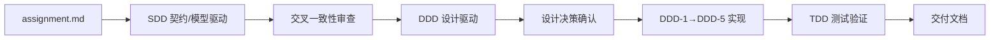

# 开发过程思路与工作流说明

> AI Panel Studio · 2026-08-05

---

## 开发流程总览

整个项目严格遵循 SDD → DDD → TDD 三阶段工程范式，每个阶段有明确的输入、产出和验证标准：

### SDD 阶段（Spec-Driven Development）

**输入：** 原始作业需求文档
**产出：** 5 份 SDD 文档（领域模型、API 契约、数据库 Schema、LLM 协议、校验层）

核心思路是"先定义接口，再讨论实现"——在编写任何代码之前，精确回答三个问题：
1. 数据长什么样？（实体、枚举、关系）
2. 前后端怎么对话？（REST 端点、WebSocket 事件、错误码）
3. AI 输出如何校验？（每个 LLM 场景的验证规则）

### DDD 阶段（Design-Driven Development）

**输入：** 确认的 SDD 文档
**产出：** 12 份 DDD 设计文档 + Design System + 35 个 Vue 组件

DDD 分两步走：先做纯设计（01–10 号文档 + UI UX Pro Max 研究），再做增量实现（DDD-1 到 DDD-5）。设计阶段锁死了 11 项关键决策——颜色方案、动画策略、布局断点、可访问性标准——实现阶段严格照图施工。

### TDD 阶段（Test-Driven Development）

**输入：** DDD 实现完成的 Vue 工程
**产出：** 7 套测试件、43 条测试、3 份交付文档

测试矩阵覆盖了三层：枚举和常量（最底层的事实基础）、Store 逻辑（状态流转正确性）、组件渲染（视觉映射符合 DDD 规范）。

---

## 与 AI 协同中的典型问题及解决路径

### 问题 1：AI 倾向于"补充缺失的需求"

**场景：** 在 SDD 需求分析阶段，原始文档明确未规定"讨论如何结束"。如果让 AI 自行判断，很可能会补充"设定 20 轮自动结束"或"主持人判断讨论充分后结束"等业务规则。

**解决路径：** 在 SDD 阶段的第一条 Prompt 中加了硬约束——"不得自行补充未经确认的业务规则"。AI 将所有模糊点归类为"待确认问题"（共 14 项），逐条向用户确认后再写入文档。这次实践中发现，**明确告知 AI "未知即未知"的边界，比让 AI 猜测要高效得多**——前者产出的是结构化的待办清单，后者产出的是需要逐个回滚的错误假设。

### 问题 2：多文档间的"漂移"——一处修改但其他文档未同步

**场景：** 用户确认了 Q3/Q4 设计决策（发言人聚焦不使用脉冲动画、PREPARING 不使用呼吸动画）。DDD 文档中的 `04-page-state-matrix.md` 和 `05-design-system.md` 立即更新了，但 `03-user-flow.md`、`07-component-architecture.md`、`10-accessibility.md` 中仍有旧的动画描述残留。

**解决路径：** 发现这个问题的不是人工逐页检查，而是用户指出后，AI 使用 `grep -rn "脉冲|呼吸" docs/ddd` 全局搜索了所有受影响文件。5 处残留一次定位、一次修复。这个教训促使我们在工作流中加入了"交叉一致性审查"步骤——**每次重大决策变更后，用 grep 全局搜索旧术语，确保零残留**。

### 问题 3：`<Teleport>` 组件在测试环境中"消失"

**场景：** `ConfirmDialog` 使用 Vue 的 `<Teleport to="body">` 将 DOM 渲染到 `document.body`。在 happy-dom 测试环境中，`wrapper.find('[role="dialog"]')` 无法找到 teleported 元素（因为它不在 wrapper 的 DOM 子树中）。

**解决路径：** 经过两次迭代：第一次改用 `document.body.querySelector` 直接查找 DOM，元素找到了但 `click()` 事件不触发 Vue 的 emit；第二次加入 `mount(Component, { attachTo: document.body })` 挂载选项，确保 Vue 的事件委托系统绑定到正确的父节点。**通用的解法是：测试 Teleport 组件时，始终使用 `attachTo: document.body` + `document.body.querySelector` 查找元素。**

---

## 对"工程化 AI 开发"的理解

这次实践让我形成了几个关于如何工程化使用 AI 的认知：

**1. AI 的上下文窗口 = 工程边界。** Claude Code 的对话上下文是有限的。如果试图在一个 Prompt 中让 AI"生成整个项目"，它会在后半段开始遗忘前半段的约束——比如 API 契约里定义了 SUMMARY 枚举值，但 LLM 协议文档里忘了让场景生成它。工程化的做法是把工作拆成 AI 能在一个上下文中完整把握的粒度（SDD → DDD → TDD 三阶段），每个阶段产出独立的、可审查的文档。

**2. 文档是 AI 的"长期记忆"。** 对话上下文会随着时间滚动丢失。但写入文件系统的文档不会。SDD 的 5 份文档、DDD 的 12 份文档，在后续每个阶段都被 AI 重新读取作为事实基础。这相当于用手写文档建立了 AI 的持久记忆——新对话中加载文档，就相当于恢复了项目上下文。

**3. 交叉审查比一次性生成可靠。** 让 AI 生成文档，然后让同一个 AI 以审查者身份重新读一遍——这种"自我审查"模式发现了 28 项只有在对比阅读时才会暴露的不一致。单独看每份文档都"对"，合在一起看才"错"。工程化 AI 开发的核心不是写出完美的第一稿，而是建立可靠的审查和修正循环。

**4. 约束前置，自由后置。** SDD 阶段先锁死数据模型和 API 契约，DDD 阶段锁死设计 Token 和组件树，TDD 阶段用测试锁死行为。越到后期，AI 的自由度越小——这是好事，因为自由度越小，偏离规范的概率越低。
